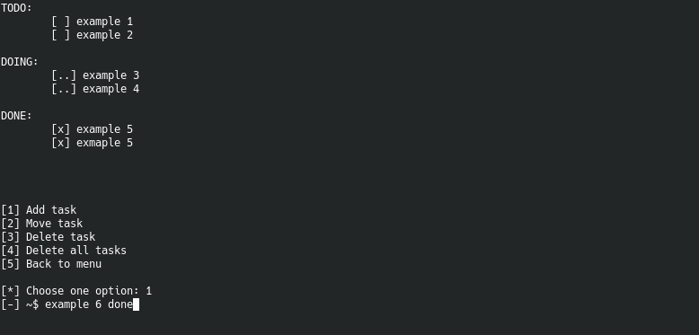

# TODO CLI

A TODO app on command-line to organize projects tasks.

## Screenshots




## Prerequisites

You need to have the following installed:

* [Python](https://www.python.org/)

## How to use?

There are three categories: TODO, DOING and DONE. Every task must belong to one of these three.

Adding, moving, and deleting a task requires a specific style.

After selecting `Tasks list`, select one of the options:

```
[1] Add task
[2] Move task
[3] Delete task
```

### Add task

The style is:

`[-] ~$ <task_name> <category>`

Example:

```
[*] Choose one option: 1
[-] ~$ application design todo
```

### Move task

The style is:

`[-] ~$ <task_name> <category>`

Example:

```
[*] Choose one option: 2
[-] ~$ application design done
```

**NOTE**: The task must be already be added in some category.

### Delete task

The style is:

`[-] ~$ <task_name>`

Example:

```
[*] Choose one option: 3
[-] ~$ application design
```

**NOTE**: The task must be already be added in some category.

## License

This project is lincesed under [MIT License](LICENSE).
