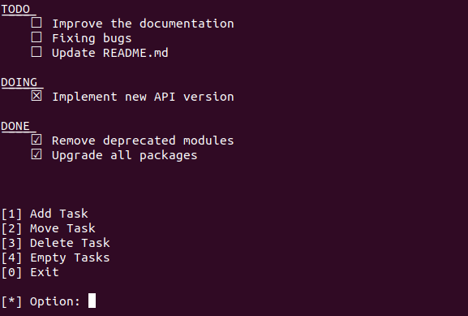

# Doddot

An application to manage your tasks easily from the command line.



## Usage

There are three categories: **TODO**, **DOING** e **DONE** and every task must belong to a category.

## Add or Move task

Use the following way to add or move a task:

`~$ <task> <category_name>`

***Note***: *The category name must be in lowercase*.

Example:

```
[*] ~$ Update README.md todo
```

## Delete task

Use the following way to delete a task:

`~$ <task>`

***Note***: *The task must belong to a category*.

Example:

```
[*] ~$ Remove deprecated modules
```

## Empty category

Use the following way to empty a category:

`~$ <category_name>`

***Note***: *The category name must be in lowercase*.

Example:

```
[*] ~$ done
```

## License

This project is licensed under [MIT License](LICENSE).
