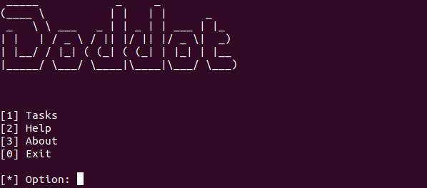
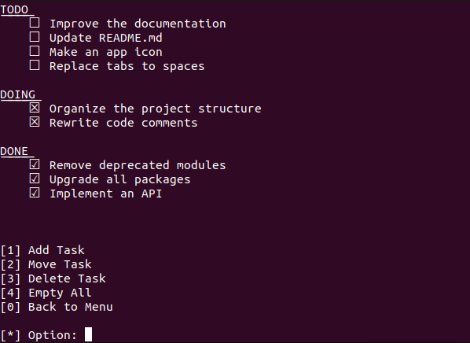

# Doddot

To-Do CLI app to organize your tasks.

## Screenshots




## How to use?

There are three categories: **TODO**, **DOING** e **DONE** and every task must belong to a category.

### Add or Move

Use the following way to add or move a task:

`~$ <task> <category_name>`

***Note***: *The category name must be in lowercase*.

Example:

```
[-] ~$ Update README.md todo
```

### Delete

Use the following way to delete a task:

`~$ <task>`

***Note***: *The task must belong to a category*.

Example:

```
[-] ~$ Remove deprecated modules
```

## License

This project is lincesed under [MIT License](LICENSE).
